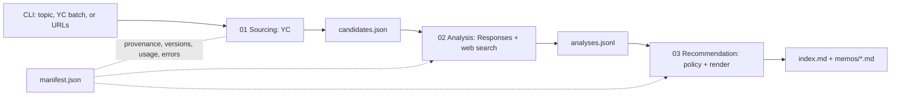

# Architecture

## Decision Summary

- One `uv` Python CLI turns an input into 10–20 analyses and 60-second memos.
- Three sibling stages exchange only versioned, Pydantic-validated JSON/JSONL.
- YC is the sole source; its adapter isolates compliant acquisition without private endpoints or unapproved scraping.
- Stage 01 is deterministic; Stages 02/03 use Responses only for analysis/writing.
- Files provide replay and lineage; tests verify code, evals model behavior.

## System at a Glance



## Repository Structure

```text
.
├── .env                         # local, gitignored secrets/config
├── .env.example                 # committed variable contract
├── .gitignore
├── README.md                    # setup, commands, sample-run link
├── pyproject.toml               # deps, CLIs, pytest, Ruff, mypy
├── uv.lock
├── inputs/yc_snapshot.jsonl     # manual or permissioned YC capture
├── src/investment_pipeline/
│   ├── cli.py                   # orchestration only
│   ├── shared/                  # schemas, config, provenance, OpenAI client
│   ├── stage_01_sourcing/       # YC adapter, normalization, dedupe
│   ├── stage_02_analysis/       # analysis + versioned prompt
│   └── stage_03_recommendation/ # policy, renderer + prompt
├── tests/{unit,contract,integration,fixtures}/
├── evals/{dataset.jsonl,graders.py,run.py,reports/}/
├── outputs/<run_id>/
├── 00-process/                  # decision trail
└── _resources/                  # supplied material
```

Dependencies move only `CLI → Stage 01 → artifact → Stage 02 → artifact → Stage 03`; every stage may import `shared`, never another stage's internals.

## Stage Contracts

| Stage | Input | Responsibility | Output | Failure behavior |
|---|---|---|---|---|
| `stage_01_sourcing` | Topic, YC batch, or URLs | Load the YC snapshot; match topic against name/tagline/description/categories, filter batch, or select exact profile URLs; normalize and dedupe | `01_sourcing/candidates.json`, `source_refs.jsonl` | Only records with `is_current_batch=true` or qualifying YC traction count toward 10–20; if fewer than 10 qualify, stop with `INSUFFICIENT_CANDIDATES` and preserve record errors |
| `stage_02_analysis` | `CandidateSetV1` | Responses Structured Output; optional web search for market evidence; Python validates five scores and total | `02_analysis/analyses.jsonl` with citations, unknowns, coverage, versions | One repair attempt, then structured candidate failure |
| `stage_03_recommendation` | `AnalysisSetV1` | Python ranks and assigns calls; Responses renders only validated evidence | `03_recommendation/memos/<candidate_id>.md`, ranked `index.md` | Record render failure; never invent a memo |

Scores are Product Adoption 25, Workflow Habit and Importance 25, Employee-to-Team Expansion 20, Enterprise Procurement Path 15, and Founder Execution Fit 15. Evidence coverage is 20% per dimension with at least one cited supporting `EvidenceItem`; missing or uncited evidence adds zero. Critical risks are cited enum values: `identity_unverified`, `requires_upfront_procurement`, `no_team_expansion_path`, `no_enterprise_procurement_path`, or `security_or_compliance_blocker`. `Take a meeting` requires top `ceil(0.10 × N)`, score ≥75, coverage ≥80%, and no critical risk; `Watch` requires score ≥55 without critical risk; otherwise `Pass`. Other risks remain in the memo without automatically setting the call.

## OpenAI SDK Boundary

`shared/openai_client.py` alone owns authentication, model/reasoning configuration, timeout, bounded retries, Pydantic parsing, usage, latency, and structured errors. Stage 02 uses [Responses](https://developers.openai.com/api/reference/cli/resources/responses/methods/create), [Structured Outputs](https://developers.openai.com/api/docs/guides/structured-outputs), and web search with returned sources. Stage 03 uses Responses without tools. The manifest stores model, prompt hash, response ID, tokens, latency, and status; hidden chain-of-thought is never stored.

## Data and Run Artifacts

`candidate_id` links `CandidateRecordV1`, evidence/citations, `AnalysisRecordV1`, recommendation, memo, and errors. Nullable facts remain unknown; self-reported claims stay labeled. Each immutable run contains `manifest.json`, `01_sourcing/`, `02_analysis/`, `03_recommendation/`, and `logs.jsonl`. The manifest records the snapshot path/hash/`captured_at`, input, stage status, paths, source URLs, versions, usage, and errors. `--from-artifact` replays downstream stages.

## Tests and Evals

| Layer | Coverage |
|---|---|
| Unit | Normalization, dedupe, proxies, freshness, score math, policy, memo limits |
| Contract/integration | Both artifact boundaries; mocked fixture-driven end to end; opt-in live smoke |
| Local evals | Deterministic schema/citation/null/length graders, then semantic thesis, faithfulness, clarity, risk, and specificity graders |

Reports are keyed by model and prompt hash. OpenAI Evals is optional later, not an MVP dependency.

## Configuration and Commands

`.env.example` defines `OPENAI_API_KEY`, `OPENAI_MODEL`, `OPENAI_REASONING_EFFORT`, `REQUEST_TIMEOUT_SECONDS`, `MAX_CANDIDATES`, and `OUTPUT_DIR`; no model is hardcoded. `README.md` links a committed representative run.

```bash
uv run investment-pipeline run --topic "AI agents for SMBs"
uv run pytest
uv run investment-evals
```

## Tradeoffs and Non-goals

- The YC adapter consumes a manually captured or permissioned public-data manifest. Sparse, self-reported traction remains `null`; `is_current_batch` shows cohort recency, not activity.
- Files and serial execution suffice for 10–20 candidates. Frontend, database, vector store, queue, workers, Docker, and multi-agent frameworks are excluded.
