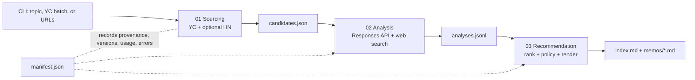

# Architecture

## Decision Summary

- A Python CLI installed by `uv` turns one input into 10–20 candidate records, analyses, and 60-second memos.
- Three sibling stage packages communicate only through versioned, Pydantic-validated JSON/JSONL contracts; dependencies move forward only.
- YC is acquired through one isolated adapter using a manually captured or otherwise permissioned public-data manifest. Public visibility is not treated as permission to scrape or use private endpoints; HN enrichment is optional.
- Stage 01 is deterministic. Stage 02 uses OpenAI for cited research and typed thesis analysis. Stage 03 uses code for ranking/calls and OpenAI only for memo wording.
- Immutable files replace a database; one `candidate_id` links each source record, analysis, memo, citation, and error.
- Tests protect code and contracts; a separate local eval harness measures model behavior against the completed YC/HN dry-run cases.

## System at a Glance



## Repository Structure

```text
.
├── .env                         # local secrets/config; gitignored
├── .env.example                 # committed variable contract; no secrets
├── .gitignore                   # ignores .env/caches/ad-hoc runs; keeps sample output
├── README.md                    # two-minute setup, commands, sample-run link
├── pyproject.toml               # deps, CLI entries, pytest, Ruff, mypy
├── uv.lock                      # reproducible dependency versions
├── src/
│   └── investment_pipeline/
│       ├── cli.py               # orchestration only
│       ├── shared/              # schemas, config, provenance, artifacts, OpenAI client
│       ├── stage_01_sourcing/   # adapters, normalization, deduplication
│       ├── stage_02_analysis/   # analysis service + versioned prompt
│       └── stage_03_recommendation/ # policy, renderer + versioned prompt
├── tests/
│   ├── unit/                    # deterministic rules
│   ├── contract/                # stage-boundary schemas
│   ├── integration/             # mocked HTTP/OpenAI end to end
│   └── fixtures/                # captured source/model fixtures
├── evals/
│   ├── dataset.jsonl            # representative YC/HN cases
│   ├── graders.py               # deterministic + semantic graders
│   ├── run.py                   # local harness, not another application
│   └── reports/                 # model/prompt-version comparisons
├── outputs/<run_id>/            # immutable artifacts, logs, manifest
├── 00-process/                  # human/AI decision trail
└── _resources/                  # supplied case material
```

`CLI → Stage 01 → artifact → Stage 02 → artifact → Stage 03`; all stages may import `shared`, but no stage imports another stage's internals.

## Stage Contracts

| Stage | Input | Responsibility | Output | Failure behavior |
|---|---|---|---|---|
| `stage_01_sourcing` | Typed topic, YC batch, or URL-list request | Resolve 10–20 YC records; normalize identity, product, team, state, strongest traction, freshness, and provenance; canonical-domain dedupe; apply proxy/no-double-count rules; optionally exact-domain join HN | `01_sourcing/candidates.json` plus `source_refs.jsonl` | Candidate retains `null` fields and an `ErrorRecord`; one bad profile does not stop the run |
| `stage_02_analysis` | Validated `CandidateSetV1` only | Analyze team, product, market, competition, why-now, risks, and unknowns; attach evidence to claims; model proposes five dimension scores; Python validates bounds and sums **25/25/20/15/15** | `02_analysis/analyses.jsonl`: typed coverage, unknowns, citations, model/prompt version | One repair call for invalid output, then a structured per-candidate failure |
| `stage_03_recommendation` | Validated `AnalysisSetV1` only | Sort by Python total; assign call; render without research; enforce rationale, risks, citations, 2–3 change-my-mind facts, and 60-second length | `03_recommendation/memos/<candidate_id>.md` and ranked `index.md` | Failed analysis gets no invented memo; render/constraint failure is recorded and ranking remains inspectable |

The score contract names Product Adoption (25), Workflow Habit and Importance (25), Employee-to-Team Expansion (20), Enterprise Procurement Path (15), and Founder Execution Fit (15).

The deterministic policy is: `Take a meeting` only when rank is within `ceil(0.10 × N)`, score is at least 75, evidence coverage is at least 70%, and no critical risk gate is present. A candidate scoring at least 55 without a critical risk is `Watch`; all others are `Pass`. Thus a 10–20 company run can produce at most 1–2 meeting calls.

## OpenAI SDK Boundary

`shared/openai_client.py` is the sole owner of the official SDK: authentication, configured model/reasoning effort, timeout, bounded transient retries, typed parsing, refusal/error mapping, latency, and usage capture. This follows the current [Responses API](https://developers.openai.com/api/reference/cli/resources/responses/methods/create), [Structured Outputs](https://developers.openai.com/api/docs/guides/structured-outputs), and [web-search](https://developers.openai.com/api/docs/guides/tools-web-search) contracts.

Stage 02 sends one candidate contract plus cited source evidence to Responses Structured Outputs using a Pydantic `AnalysisRecordV1`; it enables `web_search` only for missing market/competitive evidence and requests `web_search_call.action.sources`. Stage 03 sends validated analysis to Responses with no tools and returns a typed memo draft. A validator rejects uncited external claims.

Each call adds model, reasoning effort, prompt version/hash, response ID, token usage, latency, retry count, and status to the manifest. Prompts live beside their consuming stage. Hidden chain-of-thought is neither requested nor stored.

## Data and Run Artifacts

Core schemas are `CandidateRecordV1`, `EvidenceItem`, `Citation`, `AnalysisRecordV1`, `ScoreBreakdown`, `RecommendationRecordV1`, `ErrorRecord`, and `RunManifestV1`. The manifest records input, timestamps, stage status, paths, source URLs, versions, usage, and errors. Nullable facts distinguish unknown from negative evidence; self-reported claims are labeled. `candidate_id`, `schema_version`, source URL, excerpt, and `captured_at` preserve lineage.

Each run contains `manifest.json`, `01_sourcing/{candidates.json,source_refs.jsonl}`, `02_analysis/analyses.jsonl`, `03_recommendation/{index.md,memos/}`, and `logs.jsonl`. A stage writes atomically before its successor starts. `--from-artifact` replays downstream stages without reacquisition; completed artifacts are never modified.

## Tests and Evals

| Layer | Verifies |
|---|---|
| Unit | Normalization, domain identity, proxy precedence, freshness, score arithmetic, thresholds, top-10–20% cap, and memo limits |
| Contract/integration | Stage 01→02 and 02→03 schema compatibility; one fixture-driven end-to-end run with HTTP and OpenAI mocked; opt-in live smoke requires `OPENAI_API_KEY` and is excluded by default |
| Local evals | First: fields, citation URLs, labels, totals, null honesty, sections, length. Then semantic: thesis adherence, claim faithfulness, plain-language product, risk quality, and specific change-my-mind facts |

Eval reports are keyed by model and prompt hash. The [OpenAI grader types](https://developers.openai.com/api/docs/guides/graders) and Evals API are optional later integration, not an MVP dependency.

## Configuration and Commands

`.env.example` defines `OPENAI_API_KEY`, `OPENAI_MODEL`, `OPENAI_REASONING_EFFORT`, `REQUEST_TIMEOUT_SECONDS`, `MAX_CANDIDATES`, `OUTPUT_DIR`, and `ENABLE_HN_ENRICHMENT`. `.env` supplies local values; no model is hardcoded. `pyproject.toml` owns dependencies and both console scripts; `README.md` links one committed representative run.

```bash
uv run investment-pipeline run --topic "AI agents for SMBs"
uv run pytest
uv run investment-evals
```

## Tradeoffs and Non-goals

- The compliant MVP resolves topics/batches against a captured YC seed manifest populated by manual or permissioned export. The adapter can change later without changing stage contracts; private YC endpoints and unapproved scraping are excluded.
- YC gives strong identity/team/state coverage but sparse self-reported traction. `is_current_batch` is cohort freshness, not proof of current usage; absent HN or traction remains `null`.
- Local serial orchestration and files are sufficient for 10–20 candidates and make review/replay obvious. A frontend, database, vector store, queue, distributed workers, Docker, and multi-agent framework add no value within 6–8 hours and are excluded.
